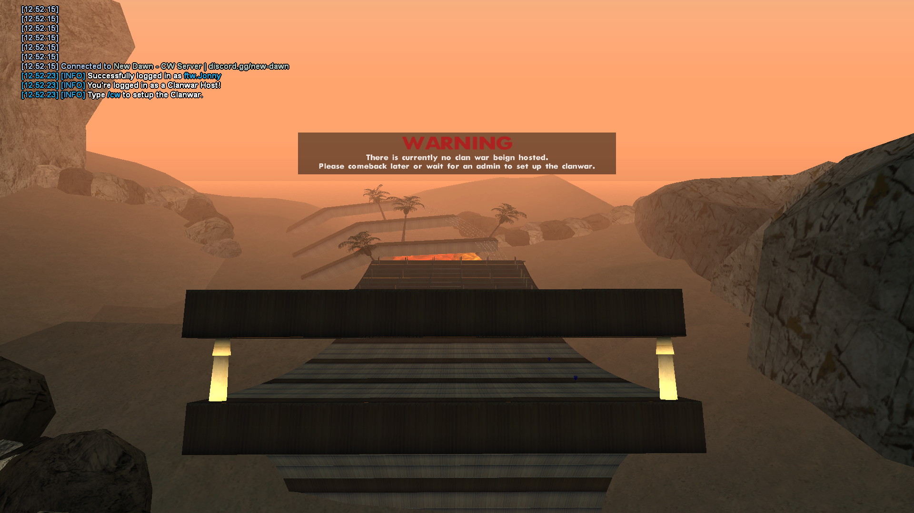
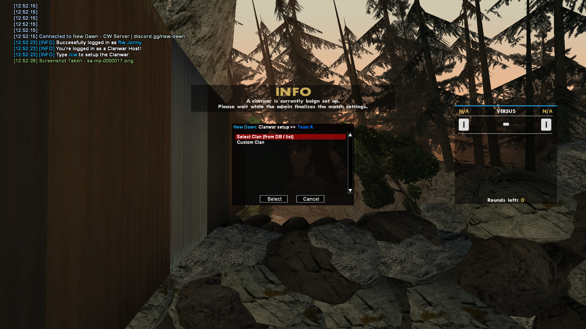
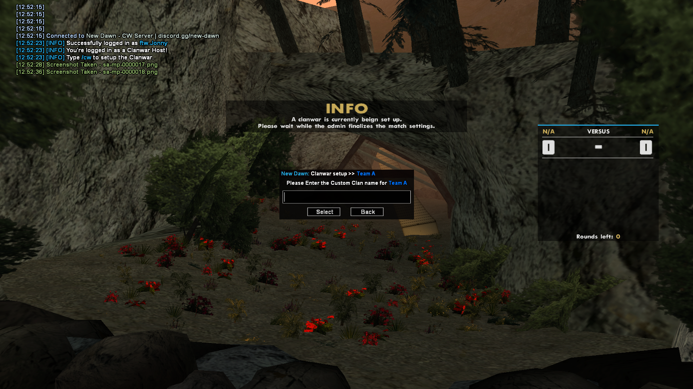
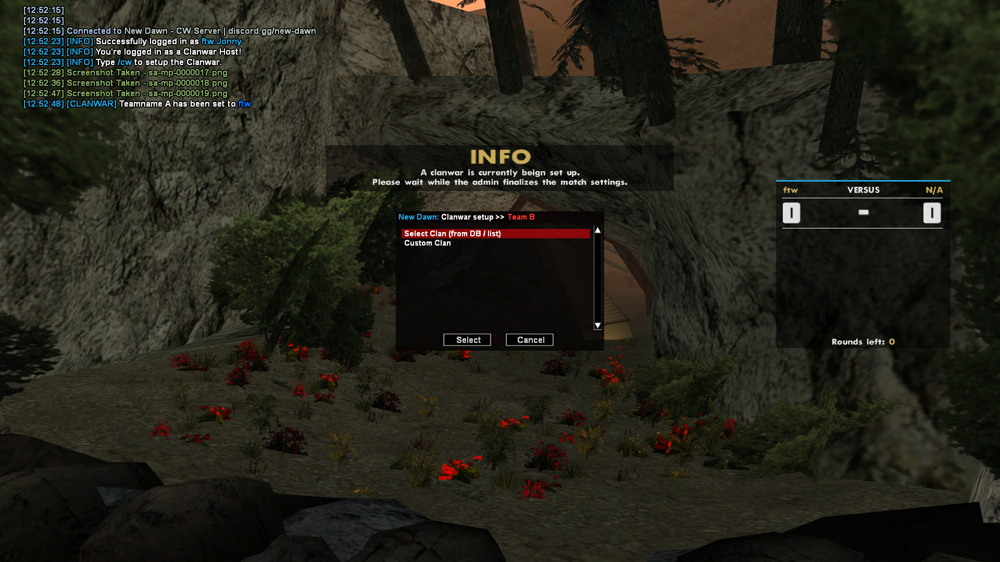
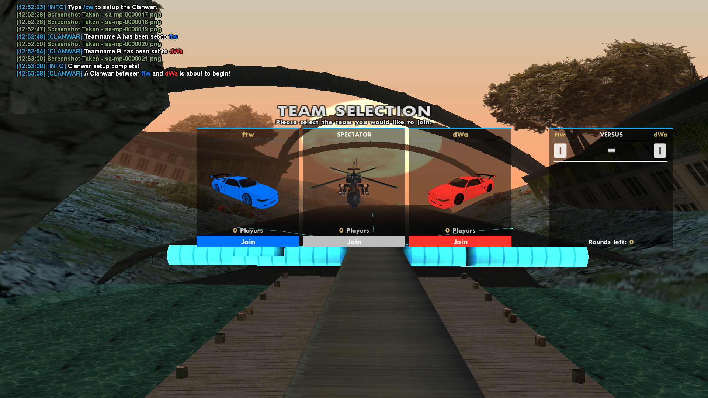
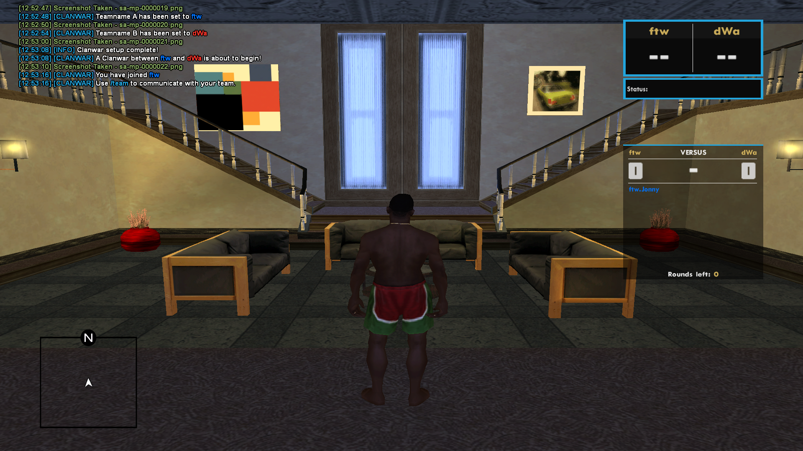
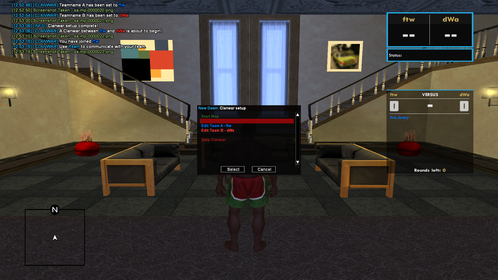
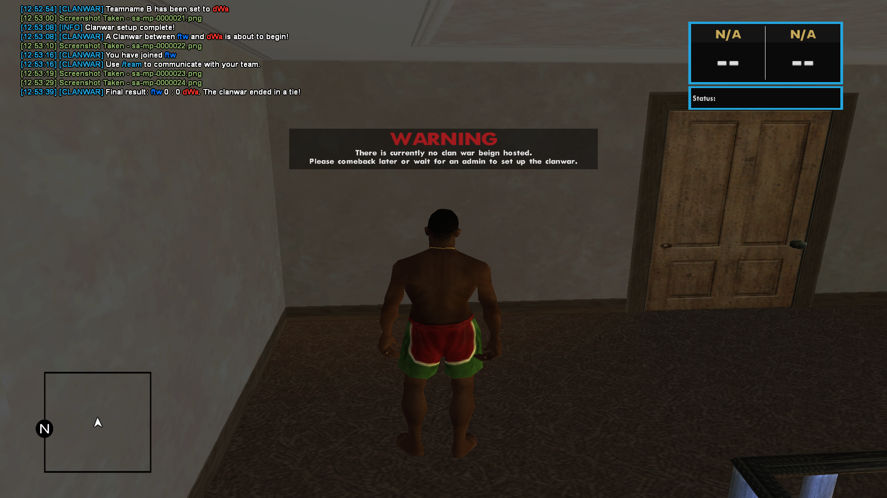

# 🛠️ Clanwar System (Core + UI Overhaul)

May 23th, 2025

> _“One system to rule them all.”_  
> Our Clanwar system just leveled up — here's what’s new in the architecture, flow, and player experience:

---

## ✅ 1. Core System Architecture

- Introduced clean `enum`-based logic:  
  `CW_STATUS_IDLE`, `CW_STATUS_SETUP`, `CW_STATUS_ACTIVE`
- `CWInfo[Status]` now drives all behavior and UI

---

## 📋 2. Setup & Control Flow

- `/cw` starts the flow
- Only `cwHost` can configure the match:
  - Team Names
  - Player Slots
- Dialog-based flow:
  - Select Clan from DB or enter Custom Clan name
- Join via **TextDraw buttons**

---

## 🎮 3. Player Management

- `SetCWTeam(playerid, teamid)` assigns players to teams
- Scoreboard updates in real-time (`ScoreBoard_TD`)
- `/team` chat limited to CW participants
- Spectators locked out

---

## 🔄 4. Clanwar Lifecycle

- **Start Clanwar** sets `CW_STATUS_ACTIVE`
- **Stop Clanwar**:
  - Auto-detects winner/tie
  - Broadcasts result
  - Logs & resets match
- `ResetClanWar()` clears:
  - Names
  - Scores
  - Teams
  - UI

---

## 🧱 5. UI & HUD Components

- TextDraws:
  - Team names
  - Player lists
  - Alive count
  - Round info

---

## 🔐 6. Admin Features

- `LogAdminAction` tracks everything

---

## 📢 7. Messaging System

- Match start, round changes
- Winner or tie announcement
- Setup/teardown logs

---

## 🧪 8. Debug & Safety

- Logs:
  - State transitions
  - Player team actions
- Prevents late joins

---

## 🆕 New: `/cw` Dialog-Based Setup

- New `/cw` command starts Clanwar setup
- Choose Team A/B from DB or custom name
- Continue into map & round config
- All steps are stage-locked via state enums

---

## 🎮 New: Team Selection UI (TextDraw)

- Players can visually pick:
  - 🔵 Team A
  - 🔴 Team B
  - 👀 Spectator
- Visuals & car icons included

---

## 📊 New: Scoreboard Overhaul

- Team names, scores, and player count shown live
- Round status clearly visible

---

## ⚠️ New: Warning System

- Centered TextDraw warns when no CW is active

---

## 📸 Screenshots

### ⚔️ Clanwar Setup

