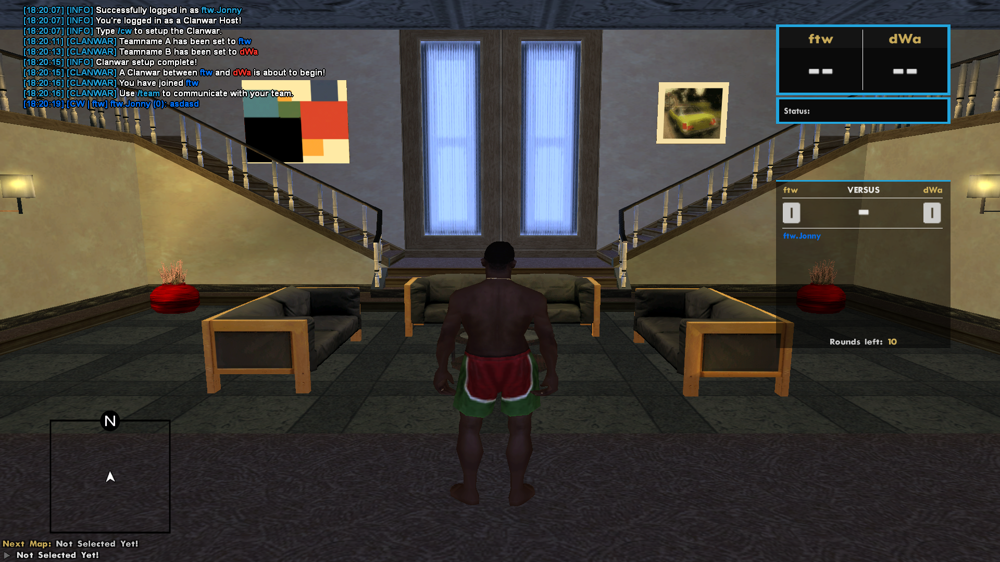
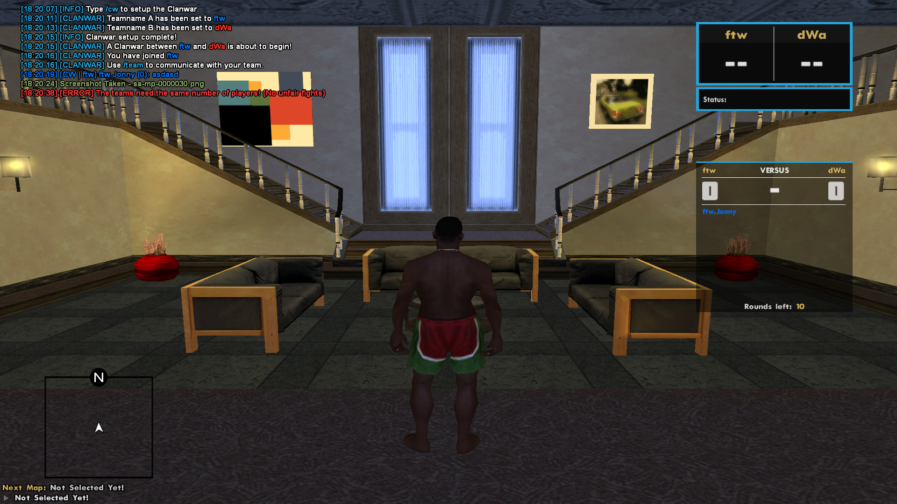
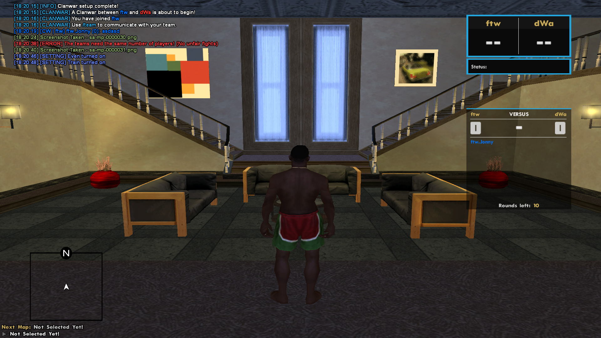
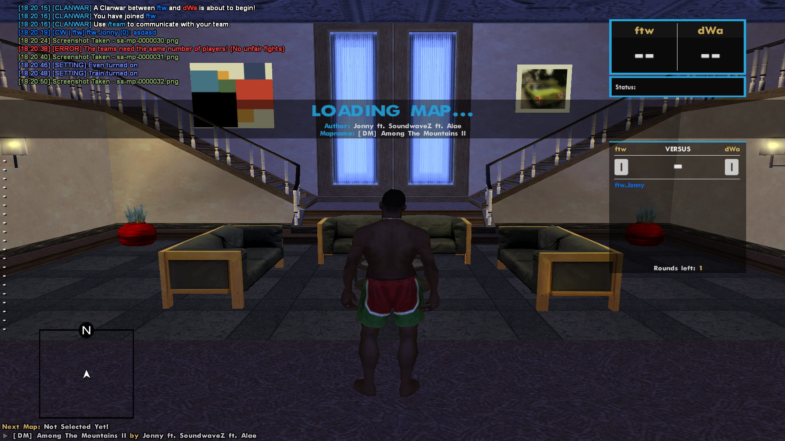
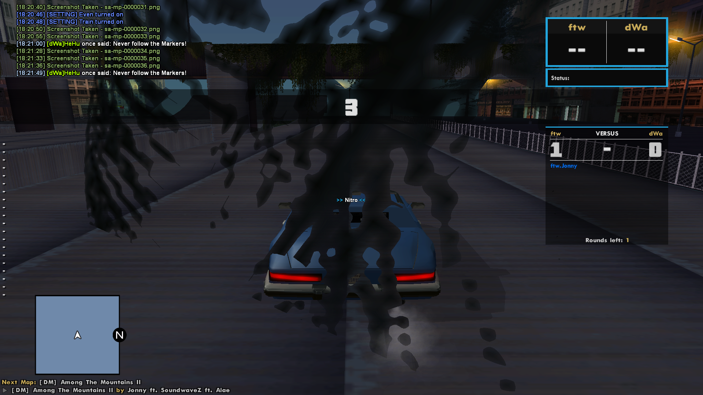
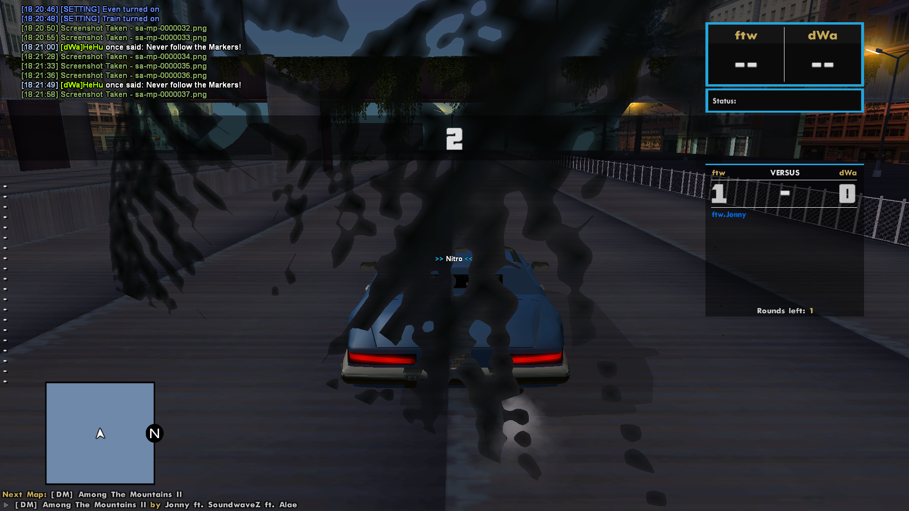
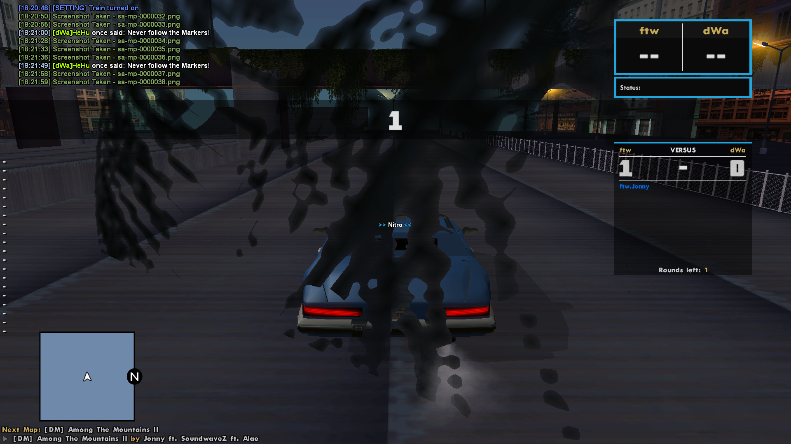
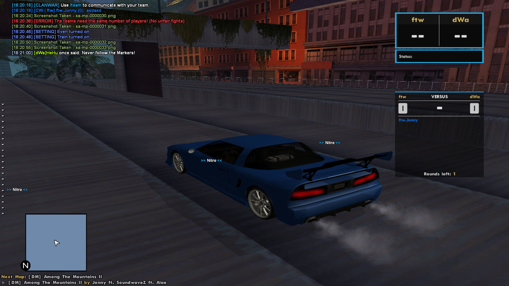
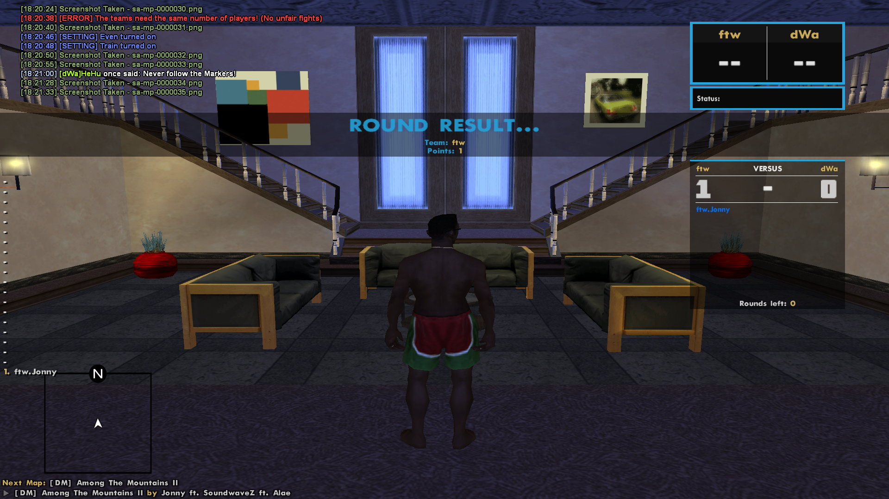

# 🕊️ A New Dawn Beckons: Clanwar Scrolls Chapter II

May 24th, 2025

> *“To map, or not to map—that is no longer the question.”*  
> — *Jonny, Lord of New Dawn*

Thus continues our tale — deeper into the digital saga.  
From the foundations laid in v2.5, we now ascend with a reworked Clanwar core and powerful maploader logic.  
Let this post guide you through all that was reforged.

---

## ✅ Clanwar System – Core Overhaul

### 🎯 Winner Logic Revamp
The `Winner(type)` function now handles:
- Victory assignment (based on last player standing)
- Score incrementation
- Floating TextDraw info updates (`SendRoundCountInformation()`)
- Round transition logic and auto `CallNextRound()` or `EndGame()`

### ⚖️ Judgement of the Fallen – `CheckTable`
Handles eliminated players and triggers victory detection when a team is wiped.
- Updates scoreboard with order of falling
- Calls `Winner()` function based on remaining teams

### 🛡️ Scoreboard Updates – `SetScoreBoard`
New deathboard system using `TextDrawSetString()` and internal scoreboard buffer (`ScoreBoardString[]`).

### 🔄 Round Flow – `CallNextRound()` & `SendToMap()`
- Resets player states, HUDs, and positions
- Loads the next map via `ChangeMap()`

### 🎬 Ending a Clanwar – `EndGame()`
- Tallies final scores
- Triggers cleanup and result broadcast
- Resets `MapOnGoing`, `CanSpawn`, and team points

---

## 🧙‍♂️ The New Maploader – `mapload.inc` Rewritten

### 🌊 Map Transitioning
- Uses `SendRconCommand()` to unload and load maps safely
- Destroys all objects and pickups
- Handles vehicle + 3D text label creation

### 🗺️ INI-Driven World Config
Maps now load from INI files:
- `Time`, `Weather`, `SpawnMode`, `Vehicle`, `Pickup` and more
- Full author and mapname display via HUD (`TextDrawSetString()`)

### 🚘 Vehicle & Pickup Logic
- Flexible spawn mode: same vehicle for all or position-based
- Dynamically reads 3D pickups (Repair, Nitro, Revert, etc.)

### 🔥 Game Logic Triggers
- `StartCountDown()` → countdown visuals & GO
- `GameOne()` → enables player control
- `CheckDrivers()` → ensures player presence before spawning

---

## 🎮 Player Elimination

### ☠️ Death + Vehicle Exit = Elimination
- Eliminated players are spectated (`SendToSpectate()`)
- Scoreboard and TextDraws updated dynamically

---

## 🛠️ What’s Next?

> “Thine new age of logic awaiteth. Rest, dreamer. For the code shall soon rise again.”

**⚒️ Next Scroll to Forge:** Modernizing all loaders, defining a clear object spawn lifecycle, and refactoring `StartCountDown` sequences.

---

## 📸 Screenshots

### 🗺️ Maploader

  

  

  

