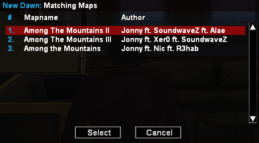
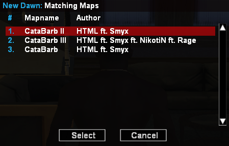

# 🛠️ Dev Update

Jun 1st, 2025

> *"To debug, or not to debug – that was never the question. It was the one typo that doomed us all."*  
> — **William Debugspeare**, probably

Hey champs, it's your favorite unpaid overachievers back again with another slice of progress – this time, **a big one**. Today was all about fixing what shouldn’t have been broken in the first place… *because apparently one wrong number = total chaos*. Here's what went down:

---

## 🎮 Spectating System – Now with 100% Less “Why Doesn’t It Work??”
We finally fixed the spectating system. 🧠  
Yes. **Really.**  
Turns out one single wrong value deep inside a function was silently nuking the whole thing. Who would’ve thought that was enough to make the entire system collapse like a wet tissue?

✅ Spectating now works as intended. Spectators can view the right players. Textdraws behave. The server breathes again.

---

## 🎯 Round Logic & Proper Endgame Recognition
After some good ol’ elbow grease, **EndRound()** now functions like a proud referee:
- ✅ Announces which team won the map
- ✅ Displays the round results with clean, sexy formatting
- ✅ Doesn’t choke halfway through (unlike the old script)

---

## 🧹 Clanwar Dialog Overhaul
We’ve *dialog’d* our way to greatness:
- 🔞 `/startmap` now opens the **Map Selection Dialog**  
- 🔞 Brand-new `StartClanwarMap()` function – clean and modular  
- 🛑 Added **proper StopClanwar logic in dialog** – no more weird half-ended wars

---

## 🧰 New Commands Galore
We added a whole bunch of **utility commands** because why not — and one of them might just reveal your soul:
- `/ip` – Get the IP *(very scary, actually – it reveals just enough to make you question your life choices)*
- `/serial` – Flex your serial
- `/pm`, `/r`, `/blockpm`, `/togpm` – Slide into DMs or slam the door shut
- `/ann` – Make announcements like it’s the 90s

---

## 📆 Under the Hood: JSON & File Wizardry
- ✅ **json.inc** and **JSON plugin** added  
- ✅ Introduced **filemanager** module  
Because what's a modern system without some structured chaos?

---

## 📸 Screenshots

---

## 💡 Final Thoughts

> *“Thou shall not pass unless your code compiles.”*  
> — William Debugspeare, moments before the last bug fix
Today was *one of those days* where progress slapped us in the face with a reminder:  
**"Check your damn values, kids."**  
Everything that seemed haunted is now running smooth – and we’re only just getting started.

Until next patch:  
Stay hydrated, comment your code, and stop breaking stuff that was already fixed 😎

— *Jonny & William Debugspeare*
