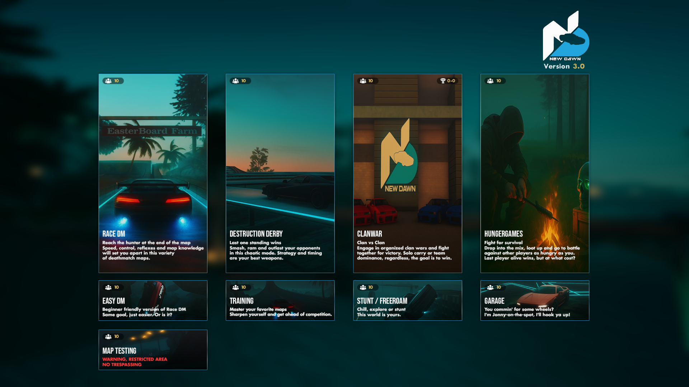
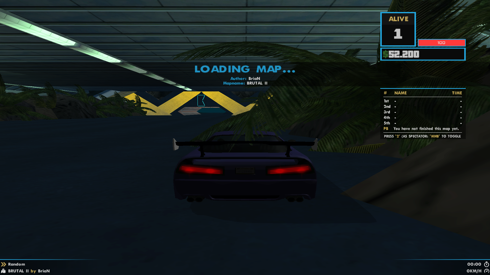
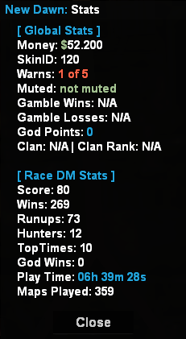

# 🚀 Dev Update New Dawn 3.0 Awakens

Jun 27th, 2025

> *"A loop by any other name would still break the server."*  
> — **William Debugspeare**, just before deleting system32

Hello Everybody 👋  
Before we dive into this glorious catastrophe of a devlog, let’s address the obvious:  
Yes, some of you with sharp detective eyes might’ve noticed older posts in this portfolio talking about a “simple clanwar server.”  

Well... that server spiraled out of control faster than a `for()` loop without an exit condition.  
What was meant to be a lightweight little project somehow transformed into **New Dawn 3.0** a name that sounds planned but was actually born out of chaos, caffeine, and us asking, *“Wait… what if we just went all in?”*

Massive credit goes to **Daniel aka Infra** and **peek** the Indiana Jones duo of ancient PAWN for recovering the unreleased, mythical **3.0 code** from digital tombs.  
No, it was never launched. No one ever got to play it. But now?  
**We’re finally giving it the release it never had just with less spaghetti and more structure.**

And no, we didn’t just slap the old thing online.  
We rewrote it, reimagined it, and probably introduced five new bugs for every one we fixed.  
But hey that’s what makes it ours.

Welcome to **New Dawn 3.0**.  
It’s new. It’s old. It’s alive.  
And this time, it’s *actually happening*.

---

## 🗳️ Community Poll You Chose 3.0

The reopening of New Dawn had one goal:  
**Bring back the nostalgic, chaotic fun we all loved.**  
But to keep that spark alive, we asked **you**, the community, to decide:

> *Should we stick to New Dawn 2.0… or take a leap into something bold?*

### **The results are in:**
- 🧱 *Stay to the roots – I prefer the current New Dawn*: **21%**
- 🚀 *Dare to evolve – welcome the new, fresh and exciting*: **79%** ✅ *(your vote)*

So here we are rebuilding, reworking, and reawakening **New Dawn 3.0**, because you asked for it.  
**The spark is back. And it’s only getting brighter.**

---

## 👀 Quick Sneak Peek – What’s Cooking?

We’re making the jump to **open.mp** why?  
Because **0.3DL is supported and still receiving updates to this day**, and that gives us the tools to push New Dawn 3.0 even further into the future. It's not just smart it’s necessary.

Here’s a glimpse at what’s brewing:

- 🛠️ **Lobby system** – fully reworked, still textdraw-based, but now 100% custom  
- 🏁 **Clanwar** – will become its own full-fledged mode in the future  
- 🗺️ **Maploader** – completely new, built from scratch, and a dream for map managers  
- 🎨 **Stylish new UI** – modern, clean, and actually pleasant to look at
- 📊 **Per-mode stats** – fully organized and tracked separately for each mode

---

## 📢 A Quick Note – Your Voice Matters

Remember: **none of this is final**.  
New Dawn 3.0 is a **community driven project**, and that means your input genuinely shapes the future of the server.

We’ll be running **polls**, asking for **feedback**, and involving you in key decisions from feature priorities to gameplay changes.  
Your opinion isn’t just welcome **it’s essential**.

So speak up, vote, suggest, roast us (lightly)
This is *your* New Dawn too.

---

## 💌 Sincerely,

Your 3.0 Dev,  
**ftw.Jonny**

With support from Head Admin & chaos enabler,  
**Xer0**

